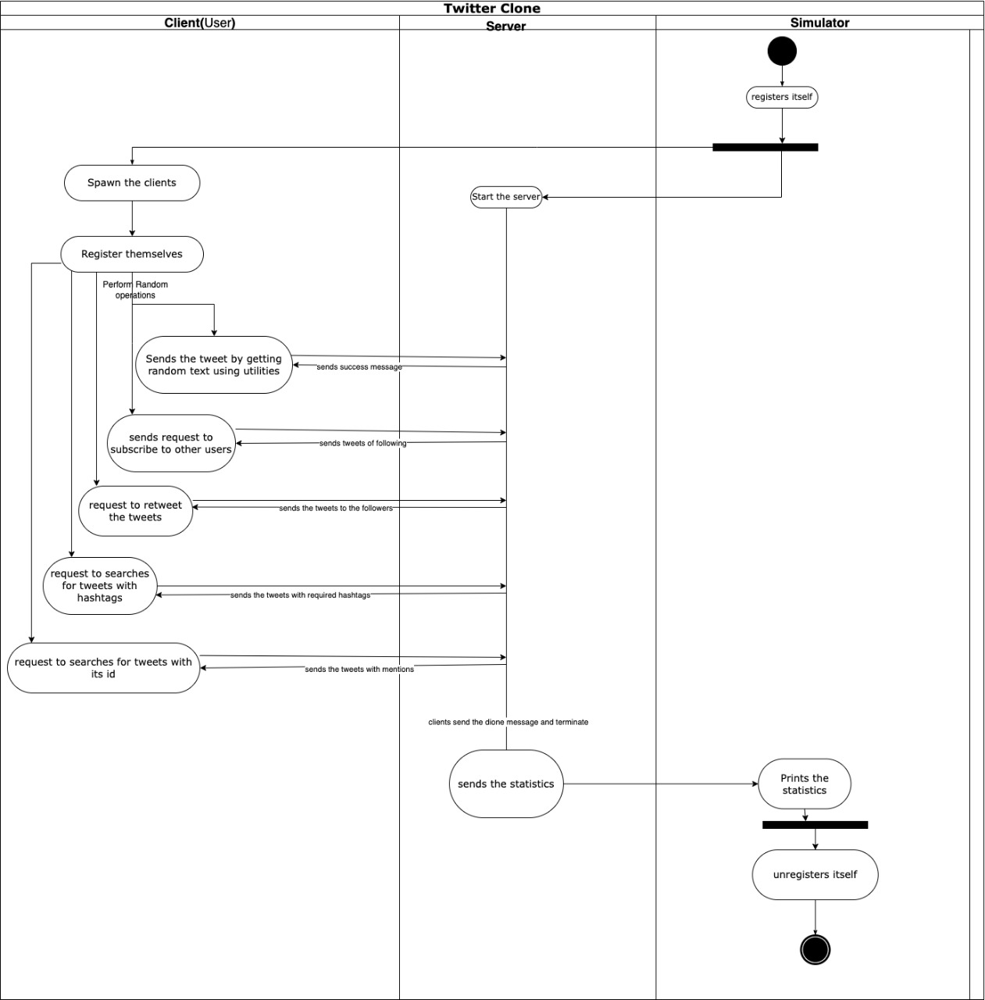

# Twitter-Clone
Implementing twitter like engine and simulating clients using actor model in erlang

**_Team Members:_**

| Name                         | Email                | UF Id     |
|------------------------------|----------------------|-----------|
| Bhagya Raj Varadaraju        | varadaraju.b@ufl.edu | 6021-2561 |
| Sharath Kumar Raju Addepalli | s.addepalli@ufl.edu  | 3358-9528 |

**_Use the following cmds to run project:_**
* chmod +x project4.sh
* ./project4.sh numUsers\
  Where "numUsers" is the number of Twitter users to simulate.

**_UML Activity Diagram_**
* Below screenshot shows all types of message sequences between server and client processes.\

**_What is working?_**
* All given N users are getting spawned.
* Users are getting signed up and their entries are being stored in the ETS table.
* Users can post the tweet and it is being sent to all the followers.
* A user can subscribe to any other user of interest. Following and Follower tables are getting updated properly.
* Any user can search for a specific hashtag and also for the tweets.
* In the below screenshot, we can see the time elapsed to serve the requests of 1600 users, without any debug print logs.\

_**Assumptions:**_
* Simulator spawns the server and client processes and waits for the performance statistics.
* Retweet operation is equivalent to two operations - searching for a trending hashtag, retweeting it to the subscribers.

_**Performance Numbers:**_

| Number of Users | Total requests served | Time elapsed (ms) |
|-----------------|-----------------------|-------------------|
| 200             | 5,642                 | 1164              |
| 400             | 12,326                | 5162              |
| 600             | 16,881                | 9847              |
| 800             | 24,951                | 24394             |
| 1200            | 33,916                | 48515             |
| 1600            | 47,210                | 109918            |

* Note: Total requests include all kinds of requests like Posting, Subscribing, Retweeting and Searching

Youtube Demo: https://youtu.be/-rishyRwNF4
